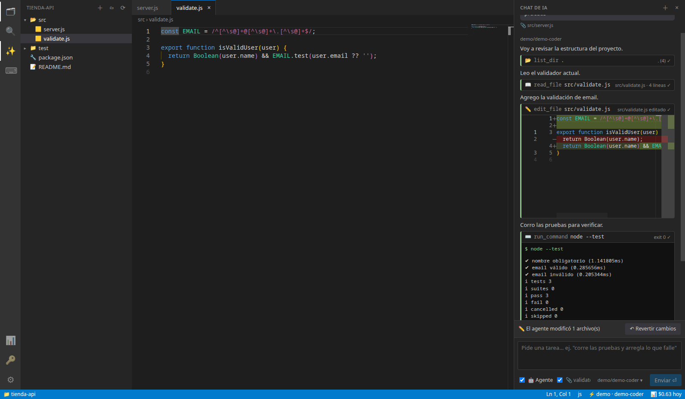

# Zinarix Studio

<p align="center"></p>

**El editor de código que funciona con cualquier IA.** 62 proveedores y 300+ modelos (de los más potentes a los de centavos, o locales y gratis con Ollama), un agente que lee tu proyecto y usa la terminal con tu aprobación, y el consumo de créditos por proveedor a la vista.

**[⬇ Descargar](https://github.com/abrahamtobal120-sudo/zinarix-studio/releases/latest)** · Windows · macOS · Linux (Ubuntu/Debian `.deb`, Arch `.pacman`, Fedora y otras con `.AppImage`)



## Funciones

- **Cualquier modelo, un clic** — selector por proveedor con precio, contexto y capacidades; un modelo distinto para chat, agente y edición (Ctrl+K).
- **Modo agente** — lee/busca archivos, edita con vista de diferencias y ejecuta comandos; todo lo que modifica pide aprobación y es reversible.
- **Consumo de créditos** — gasto de hoy y del mes por proveedor, gráfica de 30 días y presupuestos con aviso al 80 %.
- **Local y privado** — detecta Ollama / LM Studio / vLLM; modo 100 % local.
- **Llaves seguras** — en el llavero del sistema, nunca en archivos ni logs; redacción automática de secretos.
- **Editor completo** — Monaco, terminal integrada, búsqueda global, paleta de comandos, arrastrar y soltar carpetas.
- **CLI `omni`** — los mismos modelos desde la terminal.

## Desarrollo

```bash
pnpm install
pnpm build
pnpm desktop        # compila y abre la app
pnpm test           # pruebas
```

Instaladores: `pnpm --filter @omni/desktop dist` (local) o empuja un tag `vX.Y.Z` y GitHub Actions publica los de Windows, macOS y Linux. Sitio web: carpeta `website/` (Vercel).

---

## Núcleo de IA y CLI (Fase 1)

**Estado: Fase 1 completa** — núcleo de IA (`@omni/core`), adaptadores de proveedores, catálogo verificado de 50 proveedores, bóveda de llaves y la CLI `omni`.

> _English version below._

## Requisitos

- Node.js **≥ 24.7** (usa `node:sqlite` y `crypto.argon2` nativos: cero compilación de módulos nativos)
- pnpm ≥ 10 (`npm i -g pnpm`)

## Instalación

```bash
pnpm install
pnpm build
pnpm link --global --dir apps/cli   # deja `omni` en el PATH (opcional)
```

## Uso rápido

```bash
omni providers                         # catálogo de 50 proveedores (● = conectado)
omni auth add anthropic                # pide la llave oculta → keychain del SO → prueba conexión
omni auth add cloudflare-workers-ai --param account_id=abc123
omni auth add ollama                   # locales: sin llave
omni auth list                         # llaves enmascaradas (sk-…a9F2)
omni models --tools --min-context 100000
omni use anthropic/claude-opus-5-5     # modelo por defecto
omni use groq/<modelo> --role commit   # modelo por rol
omni ask "explica este error" -f src/app.ts
cat app.log | omni ask "resume los errores críticos"
omni ask --json "…" > respuesta.json   # para scripts
omni chat                              # TUI; /model <p/m> cambia de modelo a media conversación
omni compare "parser CSV en Rust" -m openai/<a> -m anthropic/<b>
omni usage --month                     # tokens y costo por proveedor/modelo
omni history search jwt
omni config set privacy.localOnly true # modo 100 % local
omni config set budgets.anthropic '{"daily":5}'
omni config set fallbacks '["groq/<modelo>"]'
omni providers add-custom --id mi-vllm --base-url http://gpu:8000/v1 --no-auth --local
omni completion zsh                    # bash | zsh | fish | powershell
```

Llaves para CI: variables de entorno estándar (`ANTHROPIC_API_KEY`, `GROQ_API_KEY`, …) o `OMNI_KEY_<ID>`.
Servidores sin keychain: `omni auth add <p> --file-vault` (AES-256-GCM + Argon2id; contraseña en `OMNI_VAULT_PASSWORD` o interactiva).

**Códigos de salida:** 0 ok · 1 error · 2 uso/config · 3 llave inválida · 4 rate limit · 5 presupuesto · 130 cancelado.

## Desarrollo

```bash
pnpm build          # tsc -b de todo el monorepo
pnpm test           # build + 78 pruebas (Vitest), incluye prueba canario anti-fugas de llaves
pnpm test:coverage  # umbral 80 % en líneas
pnpm lint && pnpm format:check
pnpm catalog:check  # valida catalog/providers.json con Zod
OMNI_LIVE_TESTS=1 ANTHROPIC_API_KEY=… OPENAI_API_KEY=… GROQ_API_KEY=… pnpm vitest run tests/live
```

## Estructura

```
apps/cli            CLI `omni` (commander + Ink)
apps/desktop        Fase 2 — fork Code-OSS (pendiente)
apps/web            Fase 6 — PWA (pendiente)
packages/shared     Esquemas Zod, tipos, errores, i18n es/en
packages/security   Secret opaco, redactor de secretos, logger que redacta
packages/providers  Cliente HTTP (retry/backoff/Retry-After/timeout/abort), SSE, adaptadores
packages/core       Config, catálogo firmado, bóveda, descubrimiento de modelos, router,
                    fallback, presupuestos, costos, historial, auditoría (SQLite)
catalog/            providers.json (50 proveedores verificados 2026-10-06) + firma Ed25519
docs/               Arquitectura, cómo agregar proveedores, entrega de Fase 1
```

Más: [docs/es/arquitectura.md](docs/es/arquitectura.md) · [docs/es/agregar-proveedor.md](docs/es/agregar-proveedor.md) · [docs/es/fase-1-entrega.md](docs/es/fase-1-entrega.md)

---

## English

Zinarix Studio is a VS Code–style, multi-AI IDE: bring your own API keys for ~50 providers and pick any model in one click.
**Status: Phase 1 complete** — editor-independent AI core, provider adapters (OpenAI-compatible, OpenAI Responses, Anthropic, Gemini), a verified 50-provider catalog with signed hot updates, an OS-keychain key vault, and the `omni` CLI (`auth`, `providers`, `models`, `use`, `ask`, `chat`, `compare`, `usage`, `history`, `catalog`, `config`, `completion`, `wipe`).

Requires Node ≥ 24.7 and pnpm. `pnpm install && pnpm build && pnpm test`. Set `OMNI_LANG=en` or pass `--lang en` for English UI strings.
See [docs/en/architecture.md](docs/en/architecture.md) and [docs/en/adding-a-provider.md](docs/en/adding-a-provider.md).

License: MIT.

## Créditos

Logos de proveedores: [Lobe Icons](https://github.com/lobehub/lobe-icons) (MIT). Las marcas pertenecen a sus respectivos dueños.
